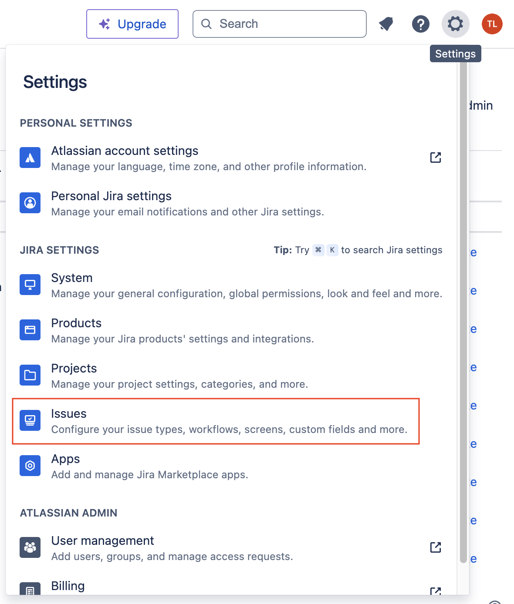
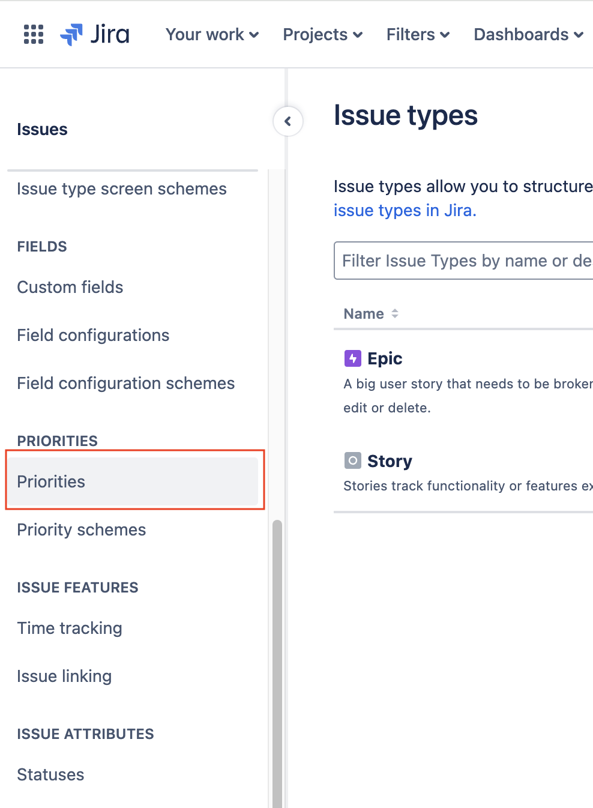
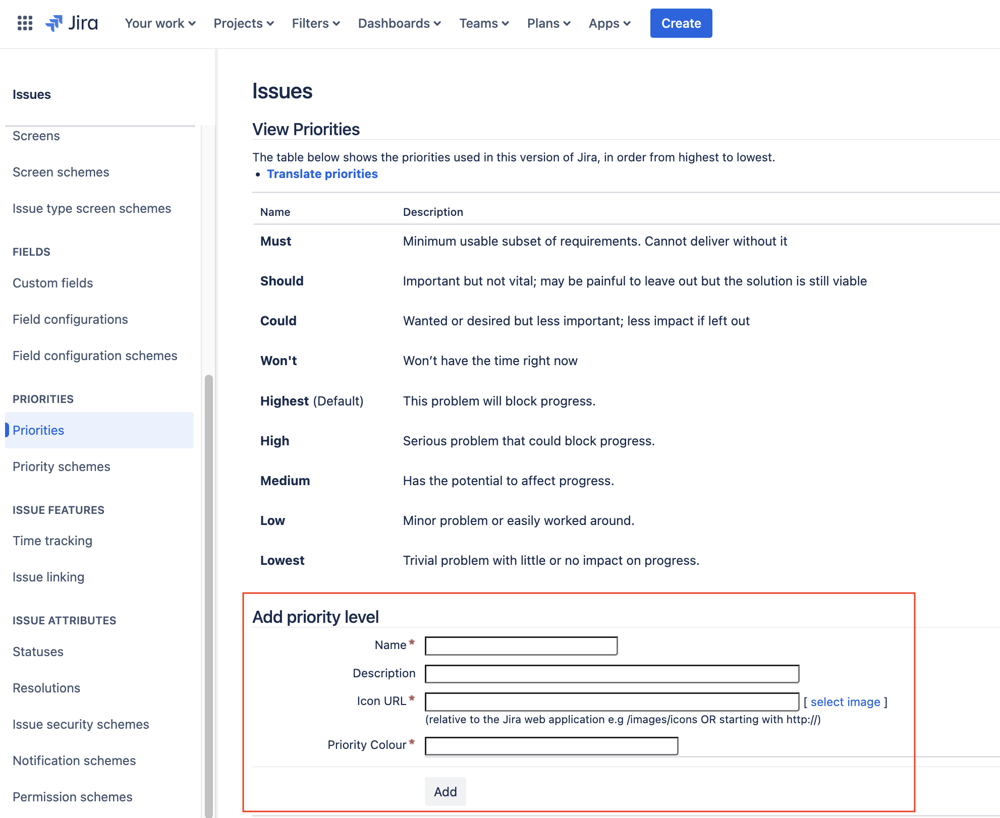
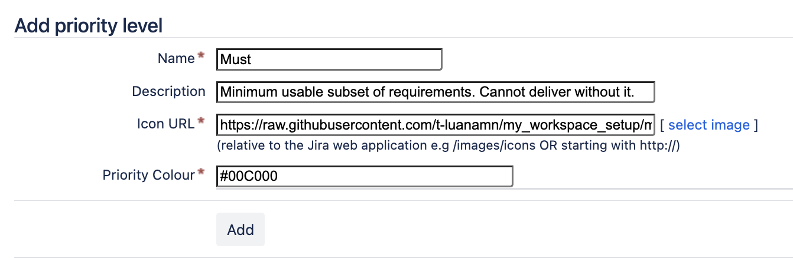
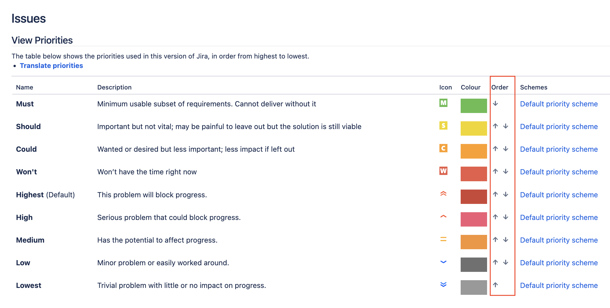

# Create a new prioritisation in Jira

#### Go to setting and select Issues

#### In left column, scroll down and select Priorities

#### Add new priority level

#### Fill the details

## Add priority level

### Must
\
Minimum usable subset of requirements. Cannot deliver without it.

#### Icon URL
<https://raw.githubusercontent.com/t-luanamn/my_workspace_setup/main/Jira_MoSCoW_Prioritisation/M.png>
#### Priority Colour
	#00C000

### Should
\
Important but not vital, the solution is still viable.
#### Icon URL
<https://raw.githubusercontent.com/t-luanamn/my_workspace_setup/main/Jira_MoSCoW_Prioritisation/S.png>
#### Priority Colour
	#FFE100

### Could
\
Wanted or desired but less important; less impact if left out.
#### Icon URL
<https://raw.githubusercontent.com/t-luanamn/my_workspace_setup/main/Jira_MoSCoW_Prioritisation/C.png>
#### Priority Colour
	#FF9400

### Won't
\
Won’t have the time/priority right now.
#### Icon URL
<https://raw.githubusercontent.com/t-luanamn/my_workspace_setup/main/Jira_MoSCoW_Prioritisation/W.png>
#### Priority Colour
	#FF1F00

#### Adjust order

# Figma icon template

Feel free to edit or create a new icon from my template.
<https://www.figma.com/community/file/1394580175968524264/moscow-icon>

